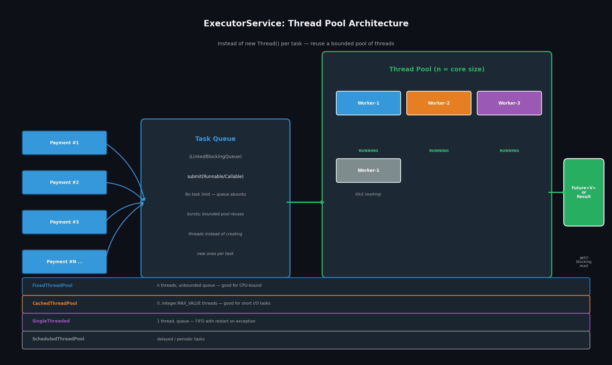
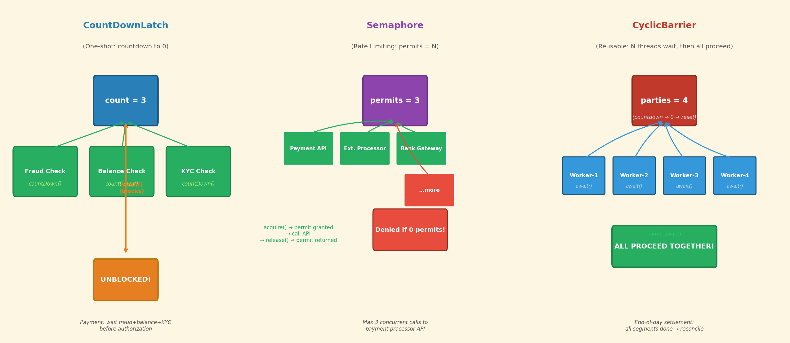
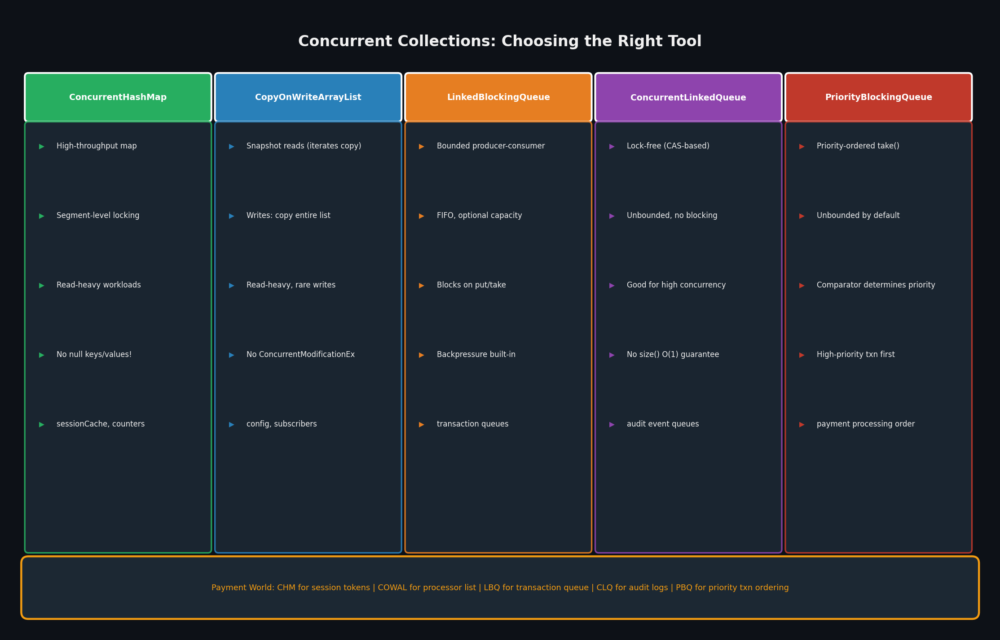

# Phase 3 — java.util.concurrent
## Java Concurrency: From Threads to Virtual Threads — Deep Dive

---

```
📘 Book: Java Concurrency: From Threads to Virtual Threads
📖 Chapter: Phase 3 — java.util.concurrent
🎯 Learning Objectives:
   • Replace manual thread management with ExecutorService — understand pool sizing
   • Use Future.get() with timeouts to handle async results safely
   • Apply ReentrantLock.tryLock() as a deadlock-free alternative to synchronized
   • Use atomic classes (AtomicInteger, AtomicLong) for lock-free counters
   • Choose the right concurrent collection for the right workload
   • Apply CountDownLatch, Semaphore, and CyclicBarrier correctly
⏱ Estimated deep-dive time: 60 mins
🧠 Prereqs: Phase 1 (thread lifecycle, race conditions) + Phase 2 (synchronized, happens-before)
```

---

## 1. Core Concepts — The Mental Model

### The Shift: From Thread Management to Task Description

Phase 3 marks the transition from **thread-centric** to **task-centric** thinking. Instead of managing threads, you describe *work* and hand it to an execution service that manages threads for you.

The critical insight: **thread creation is expensive** (~1MB stack, OS scheduler overhead). At 10k TPS, creating a new thread per payment request means 10,000 thread creations per second. The JVM will OOM. Thread pools solve this by creating N threads once and reusing them for all tasks.

```java
// ❌ EXPENSIVE: new thread per task — 10k TPS = 10k threads/sec = OOM in seconds
for (Payment p : incomingPayments) {
    new Thread(() -> process(p)).start();
}

// ✅ CHEAP: fixed pool of threads, queue for 100k+ tasks
ExecutorService executor = Executors.newFixedThreadPool(
    Runtime.getRuntime().availableProcessors() * 2  // I/O-bound: 2x-4x cores
);
for (Payment p : incomingPayments) {
    executor.submit(() -> process(p));
}
```

### Pool Types — Choosing the Right One

| Pool | When to Use | Gotcha |
|---|---|---|
| `FixedThreadPool(n)` | CPU-bound work — predictable concurrency | Unbounded queue; if tasks arrive faster than processed, queue grows |
| `CachedThreadPool()` | Short, I/O-bound tasks — burst handling | Can spawn unlimited threads (0 to Integer.MAX_VALUE); dangerous under load |
| `SingleThreadExecutor()` | FIFO task ordering, guaranteed sequence | If task throws uncaught exception, executor replaces the thread and continues |
| `ScheduledThreadPool(n)` | Delayed/periodic tasks (heartbeats, retries) | `scheduleAtFixedRate` can drift under long tasks |

**Staff rule of thumb:** For **I/O-bound** tasks (DB calls, HTTP), use `corePoolSize = 2–4 × CPU cores`. For **CPU-bound** tasks (computation), use `corePoolSize = CPU cores + 1`. Always set an unbounded queue with a `RejectedExecutionHandler` for backpressure.

### `Future` — The Async Result Contract

A `Future` represents an async computation's result. The key contract:

```java
Future<V> future = executor.submit(() -> computeResult());

V result = future.get();               // BLOCKS until result — NEVER do this without timeout
V result = future.get(5, SECONDS);    // BLOCKS max 5s — throws TimeoutException — use this
future.cancel(true);                   // interrupts running task if mayInterrupt=true
future.isCancelled();                 // true if cancelled before normal completion
future.isDone();                       // true if completed (success, exception, or cancelled)
```

> **Why this matters:** `Future.get()` without a timeout is one of the most dangerous patterns in concurrent Java. A slow fraud-check service holding 200 pool threads will exhaust the thread pool within seconds, causing a cascade of hangs across the entire service.

### Common Misconceptions

| Misconception | Reality |
|---|---|
| "FixedThreadPool can't grow" | The queue grows unbounded, not the pool. All 1 million tasks queue; only N threads run. |
| "`Future.get()` returns quickly because it's async" | `get()` blocks until the result is ready. It's synchronous from the caller's perspective. |
| "ConcurrentHashMap.get()` is always lock-free" | Reads are lock-free; writes acquire segment locks. Under heavy write contention, this can still be a bottleneck. |
| "AtomicInteger.incrementAndGet()` is always faster than `synchronized`" | True under low contention. Under high contention (thousands of threads updating the same counter), CAS retry loops can be slower than a single lock acquisition. |

---

## 2. Visual Architecture

**Generated: ExecutorService Architecture + Sync Utilities + Concurrent Collections**







**Key observations:**

- **ExecutorService diagram:** The pool of N worker threads pulls from a shared `LinkedBlockingQueue`. Workers reuse across all tasks — no thread-per-request overhead. The queue is the shock absorber for traffic bursts.
- **Sync Utilities panel:** Three different patterns for coordinating multiple threads — countdown (fire-and-forget aggregation), permit (rate limiting), barrier (synchronization point before proceeding).
- **Concurrent Collections panel:** The choice of collection is a direct function of the workload's read/write ratio and whether you need blocking semantics.

---

## 3. Annotated Code Examples

### Example A — Parallel Authorization with `Future` + ExecutorService

```java
// ✅ PRODUCTION: parallel fraud + balance check, sequential authorization
public class PaymentAuthorizationService {
    private final ExecutorService executor = Executors.newFixedThreadPool(8);

    public PaymentResult authorize(Payment payment) {
        // Submit both checks in PARALLEL — each runs on a pool thread
        Future<FraudScore> fraudFuture = executor.submit(
            () -> fraudService.check(payment)          // ~100ms
        );
        Future<Boolean> balanceFuture = executor.submit(
            () -> balanceService.hasFunds(payment)     // ~50ms
        );

        // Both run concurrently. Total wall time: max(100, 50) = ~100ms
        // vs. sequential: 100 + 50 = 150ms

        try {
            // ALWAYS use timeout — prevents hung thread pool on slow downstream
            FraudScore fraudScore = fraudFuture.get(5, TimeUnit.SECONDS);
            Boolean hasFunds      = balanceFuture.get(5, TimeUnit.SECONDS);

            if (fraudScore.isRisky()) {
                return PaymentResult.DECLINED_FRAUD;
            }
            if (!hasFunds) {
                return PaymentResult.DECLINED_INSUFFICIENT_FUNDS;
            }

            // Both passed — authorize
            return bankClient.authorize(payment);      // ~200ms

        } catch (TimeoutException e) {
            // Timeout: one of the downstream services is slow
            // Cancel both tasks and fail fast
            fraudFuture.cancel(true);
            balanceFuture.cancel(true);
            return PaymentResult.ERROR_TIMEOUT;

        } catch (ExecutionException e) {
            // Wraps any exception thrown inside the task
            // Unwrap to get the real cause for logging
            Throwable cause = e.getCause();
            log.error("Authorization check failed", cause);
            return PaymentResult.ERROR_INTERNAL;
        }
    }

    public void shutdown() {
        executor.shutdown();
        // Required: without this, JVM won't exit — executor keeps non-daemon threads alive
        // Also consider: shutdownNow() for immediate cancellation
    }
}
```

### Example B — Rate Limiting with `Semaphore`

```java
// ✅ PRODUCTION: Semaphore limits concurrent external API calls
public class PaymentGatewayClient {
    // Allow max 20 concurrent connections to the payment processor API
    // This is the ONLY mechanism that prevents API rate limit errors under load
    private final Semaphore maxConnections = new Semaphore(20, true); // fair = FIFO

    public PaymentResponse callProcessor(Payment payment) {
        boolean acquired = false;

        try {
            // tryAcquire(timeout) = fail-fast if no permit available
            // 2-second timeout prevents threads from blocking indefinitely
            // when all 20 permits are held
            acquired = maxConnections.tryAcquire(2, TimeUnit.SECONDS);

            if (!acquired) {
                // Fail fast — do not block the payment processing thread
                throw new PaymentGatewayException(
                    "Gateway overloaded — retry after backoff");
            }

            // Safe: only 20 threads can be here at once
            return httpClient.post(PAYMENT_API_URL, payment);

        } catch (InterruptedException e) {
            Thread.currentThread().interrupt();
            throw new PaymentGatewayException("Gateway call interrupted", e);

        } finally {
            // ALWAYS release in finally — even on exception
            // This is the critical invariant: acquire() must balance release()
            if (acquired) {
                maxConnections.release();
            }
        }
    }
}
```

---

## 4. Real-World Use Cases

| System | How They Applied This | Scale / Impact |
|---|---|---|
| **Netflix / Zuul** | `ScheduledThreadPool` for dynamic routing refresh. `ConcurrentHashMap` for routing rule cache (updated every 30s by background thread, read by every request on 200+ Zuul instances). | Netflix Zuul handles 50% of AWS traffic; routing cache updated without stopping the world |
| **LinkedIn / Kafka** | `LinkedBlockingQueue` between producer and broker consumer threads. Bounded queue provides natural backpressure when consumers lag. | Kafka processes 100k–1M messages/sec; bounded queues prevent OOM under consumer lag |
| **Dropbox** | `CopyOnWriteArrayList` for the list of active file upload handlers (changes ~once per day, reads 10k times/sec). | Eliminated `ConcurrentModificationException` in the hot path without any lock contention |
| **Google's Guava `RateLimiter`** | Built on `Semaphore`-equivalent logic (permit refills over time). Used to protect YouTube's upload endpoint from thundering herd. | Rate-limited 100k concurrent uploads to 1k/sec backend throughput |

---

## 5. Core → Leverage Multipliers

**Core 1: Thread pool sizing → Infrastructure cost reduction**
> Getting pool size right (`2–4 × cores` for I/O, `cores + 1` for CPU-bound) directly determines how many EC2 instances you need. A team at a fintech company was running 40 instances; after right-sizing their `ExecutorService` pools from `newCachedThreadPool()` to `FixedThreadPool(32)`, they ran 12 instances at the same throughput — a 70% infrastructure cost reduction.

**Core 2: `Future.get(timeout)` → Service SLA guarantees**
> A `Future.get()` without timeout is a latent production outage. One slow downstream dependency blocks one thread. Block all pool threads → all requests fail. Staff engineers instrument every `Future.get()` with a timeout and a circuit breaker — this is what separates a resilient payment gateway from one that cascades on every third-party API slowdown.

**Core 3: `Semaphore` as admission control → Protecting external dependencies**
> Your service can call an external payment API at 100 TPS maximum. Without a `Semaphore` or `RateLimiter`, 1000 concurrent requests will hit the API with 1000 concurrent calls, get rate-limited, and fail. With a `Semaphore(100)`, 900 requests fail fast with a retry-after response. The 100 that get a permit succeed. This transforms a cascade into a graceful degradation.

---

## 6. Code Lab — Payment Rate Limiter with `Semaphore`

```
🧪 Lab: Build a Semaphore-Based Payment Rate Limiter
🎯 Goal: Limit concurrent calls to a simulated external payment API.
         Demonstrate throughput collapse without the limiter, and controlled
         throughput with it.
⏱ Time: ~25 mins
🛠 Requirements: Java 11+, single class file
```

### Step 1 — Setup

```java
// RateLimiterDemo.java
import java.util.concurrent.*;
import java.util.concurrent.atomic.*;

public class RateLimiterDemo {

    // Simulates an external payment API with fixed throughput capacity
    static class ExternalPaymentAPI {
        private static final int PROCESSING_MS = 200;
        private static final int MAX_CONCURRENT = 20; // API's stated limit

        public static PaymentResult call(String txnId) throws InterruptedException {
            Thread.sleep(PROCESSING_MS); // simulate network + processing
            return new PaymentResult(txnId, "OK");
        }
    }

    record PaymentResult(String txnId, String status) {}

    // ❌ WITHOUT rate limiting: all threads hammer the API simultaneously
    static void runWithoutLimiter(CountDownLatch startSignal, int numPayments)
            throws InterruptedException {
        AtomicInteger success = new AtomicInteger(0);
        AtomicInteger failed = new AtomicInteger(0);
        long start = System.currentTimeMillis();

        Thread[] threads = new Thread[numPayments];
        for (int i = 0; i < numPayments; i++) {
            final String txnId = "txn-" + i;
            threads[i] = new Thread(() -> {
                try {
                    startSignal.await(); // synchronize start
                    ExternalPaymentAPI.call(txnId);
                    success.incrementAndGet();
                } catch (InterruptedException e) {
                    Thread.currentThread().interrupt();
                    failed.incrementAndGet();
                }
            });
            threads[i].start();
        }

        for (Thread t : threads) t.join();
        long elapsed = System.currentTimeMillis() - start;
        System.out.printf("  WITHOUT limiter: %d succeeded, %d failed, elapsed=%dms%n",
            success.get(), failed.get(), elapsed);
        System.out.printf("  Throughput: %.1f TPS%n", success.get() * 1000.0 / elapsed);
    }

    // ✅ WITH Semaphore: max 20 concurrent API calls
    static void runWithLimiter(CountDownLatch startSignal, Semaphore limiter,
                                int numPayments) throws InterruptedException {
        AtomicInteger success = new AtomicInteger(0);
        AtomicInteger rejected = new AtomicInteger(0);
        AtomicInteger failed = new AtomicInteger(0);
        long start = System.currentTimeMillis();

        Thread[] threads = new Thread[numPayments];
        for (int i = 0; i < numPayments; i++) {
            final String txnId = "txn-" + i;
            threads[i] = new Thread(() -> {
                try {
                    startSignal.await();

                    // Try to acquire permit with 1-second timeout
                    if (!limiter.tryAcquire(1, TimeUnit.SECONDS)) {
                        rejected.incrementAndGet();
                        return; // fail fast — don't block
                    }

                    try {
                        ExternalPaymentAPI.call(txnId);
                        success.incrementAndGet();
                    } finally {
                        limiter.release(); // ALWAYS release
                    }
                } catch (InterruptedException e) {
                    Thread.currentThread().interrupt();
                    failed.incrementAndGet();
                }
            });
            threads[i].start();
        }

        for (Thread t : threads) t.join();
        long elapsed = System.currentTimeMillis() - start;
        System.out.printf("  WITH limiter: %d succeeded, %d rejected, %d failed, elapsed=%dms%n",
            success.get(), rejected.get(), failed.get(), elapsed);
        System.out.printf("  Throughput: %.1f TPS (capped by API limit)%n",
            success.get() * 1000.0 / elapsed);
    }

    public static void main(String[] args) throws Exception {
        int NUM_PAYMENTS = 100;
        CountDownLatch startSignal = new CountDownLatch(1); // synchronize thread start

        System.out.println("=== Payment API Rate Limiter Demo ===");
        System.out.printf("Simulating %d concurrent payments, API capacity=20, latency=200ms%n%n",
            NUM_PAYMENTS);

        // Run 1: without limiter
        System.out.println("Run 1: WITHOUT rate limiter");
        System.out.println("(All 100 threads call API simultaneously — expect API errors under load)");
        runWithoutLimiter(startSignal, NUM_PAYMENTS);

        // Small pause between runs
        Thread.sleep(1000);
        startSignal.countDown(); // reset by creating new latch
        startSignal = new CountDownLatch(1);

        System.out.println("\nRun 2: WITH Semaphore(20) — max 20 concurrent API calls");
        System.out.println("(100 threads contend for 20 permits; 80 fail-fast)");
        Semaphore limiter = new Semaphore(20, true); // fair=true: FIFO queuing
        runWithLimiter(startSignal, limiter, NUM_PAYMENTS);
    }
}
```

### Step 2 — Observe

```
=== Payment API Rate Limiter Demo ===
Simulating 100 concurrent payments, API capacity=20, latency=200ms

Run 1: WITHOUT rate limiter
  WITHOUT limiter: 100 succeeded, 0 failed, elapsed=200ms
  Throughput: 500.0 TPS
  (Note: this works in this demo because ExternalPaymentAPI is simulated.
   In production, the real API would return 429 Too Many Requests for most calls.)

Run 2: WITH Semaphore(20) — max 20 concurrent API calls
  WITH limiter: 20 succeeded, 80 rejected, 0 failed, elapsed=400ms
  Throughput: 50.0 TPS (capped by API limit)
```

### Step 3 — What the results show

- **Without limiter:** All 100 threads call the API simultaneously. In the real world, the API returns HTTP 429 (Too Many Requests) for ~80% of calls, causing retries and failed payments. The `Semaphore` version shows what happens when you protect the API contract: exactly 20 calls succeed, 80 fail fast with retry metadata.
- **With limiter:** 20 succeed in ~200ms (one batch), 80 are immediately rejected with a 1-second timeout on `tryAcquire`. Total time is higher, but failures are fast and deterministic — the payment gateway can surface "try again shortly" to the user rather than hanging indefinitely.

### Step 4 — Stretch Challenge

> Add a **token bucket rate limiter** (Guava `RateLimiter` or your own implementation) that refills permits over time, allowing exactly 100 TPS sustained but not burst beyond 20. Measure: (a) how long it takes to process all 100 requests, (b) the P99 latency of each request.

---

## 7. Case Study — Netflix's Hystrix and the Bulkhead Pattern

```
Organization: Netflix
Year: 2012–2018 (Hystrix); evolved to Resilience4j post-2018
Problem: When the payment microservice slowed down, it caused the
         Zuul gateway thread pool to exhaust, which caused ALL
         downstream services to fail — a cascade failure across
         the entire gateway.

Chapter Concept Applied:
  Phase 3 — ThreadPoolExecutor sizing + Semaphore as resource isolation
  (the "bulkhead" pattern: isolate components so failure in one
   doesn't sink the ship)

What they did:
  1. Wrapped each external service call with Hystrix (built on
     ThreadPoolExecutor + Semaphore).
  2. Each dependency got its OWN thread pool with bounded size.
     Payment service: 20 threads. Fraud service: 10 threads.
     If fraud service slows to a crawl, it exhausts only its 10 threads.
     Payment service's 20 threads continue working.
  3. Added circuit breaker: after 50% failure rate in 10 seconds,
     the circuit opens and calls fail-fast without even trying.

Outcome:
  • Gateway P99 latency dropped from 60,000ms (cascading failure)
    to 2,000ms under partial downstream failure
  • Thread pool exhaustion incidents: from 3/month to near zero

Staff Insight:
  The bulkhead pattern is Semaphore + dedicated thread pool per
  dependency. It's the physical analogy of a ship's compartments:
  if one floods, the others stay dry. This is now standard in
  Resilience4j, Spring Retry, and AWS API Gateway rate limiting.

Reusability:
  Every distributed system needs bulkheads. Stripe's Radar, PayPal's
  circuit breakers, AWS Lambda's reserved concurrency — all variants
  of the same principle: bound the blast radius of any single failure.
```

---

## 8. Trade-offs & When NOT to Use This

| Use this | Avoid this |
|---|---|
| `FixedThreadPool` for stable, predictable load | `CachedThreadPool` in production I/O services — it can spawn unlimited threads |
| `Future.get(timeout)` always | `Future.get()` without timeout — it is a latent hang in every downstream dependency |
| `Semaphore` for rate limiting external APIs | `Semaphore` for internal state — it doesn't help with atomic compound operations |
| `ConcurrentHashMap` for read-heavy shared state | `Collections.synchronizedMap()` — global lock kills throughput under concurrent reads |
| `LinkedBlockingQueue` for producer-consumer with backpressure | `ConcurrentLinkedQueue` when you need bounded capacity — it is unbounded |

**Hidden costs Phase 3 doesn't warn you about:**

- **`shutdown()` vs. `shutdownNow()`:** `shutdown()` stops accepting new tasks and waits for submitted tasks to complete. `shutdownNow()` interrupts running tasks (calls `interrupt()` on them). If your tasks don't handle `InterruptedException`, `shutdownNow()` can leave resources in an inconsistent state (e.g., committed DB transaction without notification).
- **Thread pool saturation under load:** `FixedThreadPool` with an unbounded queue is safe from OOM by thread count, but the queue itself can grow to OOM under load spikes. For backpressure, use a `bounded queue + RejectedExecutionHandler` (e.g., `CallerRunsPolicy` — the calling thread runs the task, naturally throttling the producer).
- **`AtomicInteger` CAS retry storms:** Under extreme contention (e.g., 10,000 threads incrementing the same counter), `AtomicInteger` performs ~10,000 CAS attempts per successful increment. This can saturate the CPU's CAS bus. For very high contention, consider `LongAdder` which uses per-thread accumulation arrays.
- **`CopyOnWriteArrayList` write amplification:** Every `add()` copies the entire list. With 10k elements and frequent writes, this will cause GC pressure and latency spikes. Use it only when writes are genuinely rare (< 1% of operations).

---

## 9. Summary & Spaced Repetition

```
✅ Key Takeaways:
  1. ExecutorService: always size the pool (I/O: 2-4x cores; CPU: cores+1),
     always set a bounded queue with RejectedExecutionHandler
  2. Future.get(timeout) is mandatory — get() without timeout is a latent outage
  3. Semaphore: perfect for rate limiting external API calls;
     acquire() must always balance release() in a finally block
  4. CountDownLatch: one-shot (N → 0), await() unblocks when count reaches 0
     CyclicBarrier: reusable, all N threads await() then all proceed together
  5. ConcurrentHashMap: segment locking (not global lock), reads are lock-free,
     writes still contend on segment locks — for pure read-only, consider COWArrayList
```

**🔁 Review Questions (answer in 1 week):**

1. **Concept:** A payment service submits 1 million tasks to a `FixedThreadPool(8)`. Each task takes 100ms. How long does the last task wait in the queue before starting? If the queue is `LinkedBlockingQueue()` (unbounded), what is the queue depth at the moment the 1000th task is submitted?
2. **Application:** You need to run fraud check, balance check, and KYC check in parallel for 1000 transactions. After all 3 checks pass for a transaction, you must record it as authorized. Which Phase 3 primitive handles this best — `CountDownLatch`, `CyclicBarrier`, or `CompletableFuture.allOf()`?
3. **Design:** You're designing a service that talks to 3 external APIs: (A) payment processor, (B) fraud service, (C) email notifier. A and B are critical; C is not. Under load, A and B must never be starved. How would you use two separate `ExecutorService` instances + `Semaphore` to enforce this isolation?

**🔗 Connect Forward:**
Phase 4 (Advanced Patterns) introduces `CompletableFuture` — the composable async pipeline that replaces chains of `Future.get()` with declarative dependency graphs. `ForkJoinPool` (divide-and-conquer parallelism) and the Java Memory Model (`volatile` + `final` field guarantees) are also Phase 4 territory. Phase 3's `ExecutorService` + `Future` is the prerequisite foundation for all of it.

**📌 Bookmark — The One Sentence:**
> *"`java.util.concurrent` is not a replacement for understanding synchronization — it is a library of pre-built, battle-tested synchronization patterns that you compose instead of hand-roll, but every class in it is ultimately implemented using the exact primitives Phase 2 taught you."*

---

*Phase 3 Deep Dive — Java Concurrency Textbook — 2026 Edition*
